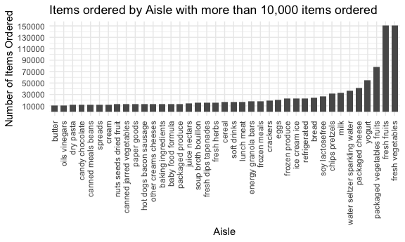
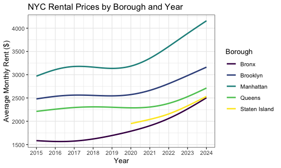
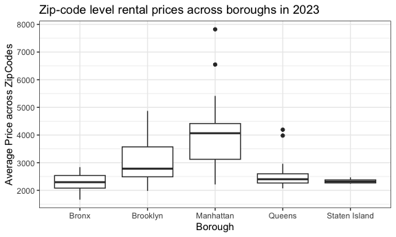
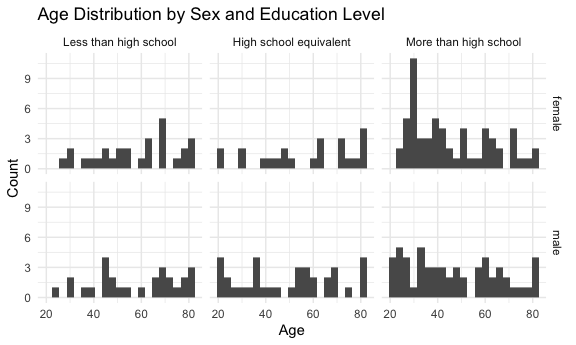
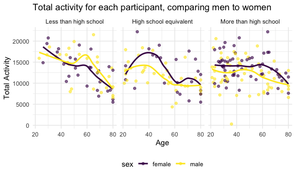
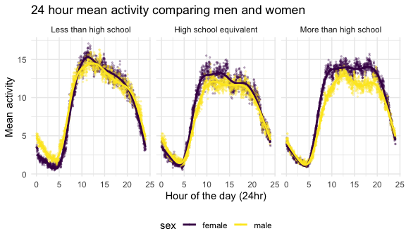

Homework 3
================
ruby
2025-10-02

## Problem 1

``` r
library(p8105.datasets)
data("instacart")
```

The `instacart` dataset contains 1384617 observations and 15 variables.
Each row represents a product from an order. There are 131209 unique
order_ids. Some variables in the dataset include order day of the week,
order hour of the day, and information about the items ordered including
the product name, the aisle it was in, and which department it falls
into. For example, order_id 1145 ordered 29 items on Friday including
items such as strawberries, spinach pizza, multi grain cheerios cereal,
and everything bagels.

``` r
aislecnt = instacart |> 
  count(aisle, name = "n_obs") |> 
  arrange(desc(n_obs))
```

There are 134 aisles in total. The aisles with the most items ordered
are fresh vegetables with 150609 items, fresh fruits with 150473 items,
and packaged vegetables fruits with 78493 items.

### Plot

``` r
aislecnt |> 
  filter(n_obs > 10000) |> 
  ggplot(aes(x = reorder(aisle, n_obs), y = n_obs)) +
  geom_col(width = 0.7) +
  scale_y_continuous(breaks = seq(10000, 150700, by = 20000)) +
  theme (
    axis.text.x = element_text(angle = 90, hjust = 1, vjust = 0.5)
  ) +
  labs(x = "Aisle", 
       y = "Number of Items Ordered", 
       title = "Items ordered by Aisle with more than 10,000 items ordered")
```


Items in the fresh vegetables aisle are the most ordered followed
closely by fresh fruits. Packaged vegetables and fruits are the 3rd most
ordered. This would make sense as these items are most likely ordered
weekly, as they may go bad quicker, and are eaten more frequently.The
aisles for butter, oils, candy/chocolates have less items ordered
because there may be less of a need to get these frequently.

### Table with 3 most popular items in each of the aisles

``` r
instacart |> 
  filter(aisle %in% c("baking ingredients", "dog food care", "packaged vegetables fruits")) |> 
  group_by(aisle, product_name) |> 
  summarize(count = n()) |> 
  arrange(desc(count)) |> 
  slice_max(order_by = count, n=3) |> 
  knitr::kable(digits = 1)
```

| aisle | product_name | count |
|:---|:---|---:|
| baking ingredients | Light Brown Sugar | 499 |
| baking ingredients | Pure Baking Soda | 387 |
| baking ingredients | Cane Sugar | 336 |
| dog food care | Snack Sticks Chicken & Rice Recipe Dog Treats | 30 |
| dog food care | Organix Chicken & Brown Rice Recipe | 28 |
| dog food care | Small Dog Biscuits | 26 |
| packaged vegetables fruits | Organic Baby Spinach | 9784 |
| packaged vegetables fruits | Organic Raspberries | 5546 |
| packaged vegetables fruits | Organic Blueberries | 4966 |

In the baking ingredients aisle, light brown sugar, pure baking soda,
and cane sugar as the most popular. These are pretty essential
ingredients when it comes to baking, so it would make sense that they
are purchased the most in the baking ingredients aisle. Popular items in
the package vegetables/fruits aisle include organic baby spinach,
raspberries, and blueberries. This could be due to the fact that these
are popular smoothie items and people generally buy pre-packaged
vegetables/fruits for this purpose. Dog treats, wet food, and dog
biscuits are the most popular items in the dog food care aisle.

### Table showing the mean hour of the day at which Pink Lady Apples + Coffee Ice Cream are ordered

``` r
instacart |> 
  filter(product_name %in% c("Pink Lady Apples", "Coffee Ice Cream")) |> 
  mutate(order_dow = recode(order_dow,
                            `0` = "Sunday", `1` = "Monday", `2` = "Tuesday",
                            `3` = "Wednesday", `4` = "Thursday",
                            `5` = "Friday", `6` = "Saturday"),
         order_dow = factor(order_dow, levels = c("Sunday", "Monday", "Tuesday", "Wednesday", "Thursday", "Friday", "Saturday"), ordered = TRUE)) |> 
  group_by(product_name, order_dow) |> 
  summarize(mean_hour = mean(order_hour_of_day, na.rm = TRUE)) |> 
  pivot_wider(
    names_from = order_dow,
    values_from = mean_hour
  ) |> 
  knitr::kable(digits = 1)
```

| product_name     | Sunday | Monday | Tuesday | Wednesday | Thursday | Friday | Saturday |
|:-----------------|-------:|-------:|--------:|----------:|---------:|-------:|---------:|
| Coffee Ice Cream |   13.8 |   14.3 |    15.4 |      15.3 |     15.2 |   12.3 |     13.8 |
| Pink Lady Apples |   13.4 |   11.4 |    11.7 |      14.2 |     11.6 |   12.8 |     11.9 |

Pink lady apples are ordered generally earlier in the day, and coffee
ice cream is ordered all after noon (12 pm). Mean hour of day ordered
for both items are about the same on Friday and Sunday, and are the most
difference on Tuesday.

## Problem 2

import and clean zip code data

``` r
zipcode_df = 
  read_csv("data/Zip Codes.csv") |> 
  janitor::clean_names() |> 
  mutate(
    borough = case_match(
      county,
      "Bronx" ~ "Bronx",
      "Kings" ~ "Brooklyn",
      "New York" ~ "Manhattan",
      "Queens" ~ "Queens",
      "Richmond" ~ "Staten Island"
    )
  ) |> 
  select(zip_code, borough, neighborhood) |> 
  distinct(zip_code, .keep_all = TRUE)
```

import and clean zori data

``` r
nyc_zillow_df = 
  read_csv("data/Zip_Zori_uc_sfrcondomfr_sm_month_NYC.csv") |>
  janitor::clean_names() |>
  pivot_longer(x2015_01_31:x2024_08_31,
    names_to = "month",
    values_to = "price",
    names_prefix = "x") |> 
  rename(zip_code = region_name) |> 
  mutate(
    month = as_date(month),
    year = floor_date(month, unit = "year"),
    zip_code = as.numeric(zip_code)) |> 
  select(-county_name)

nyc_price_df = 
  left_join(nyc_zillow_df, zipcode_df, by = "zip_code")
```

### Zip code appearances

``` r
nyc_price_df |> 
  group_by(zip_code) |>
  drop_na(price) |> 
  summarize(count = n()) |> 
  summarize(
    obs116 = sum(count == 116),
    less10 = sum(count < 10))|> 
  knitr::kable(digits = 1)
```

| obs116 | less10 |
|-------:|-------:|
|     48 |     26 |

48 zip codes appear 116 times and 26 appear less than 10 times. Some zip
codes may be observed more in a month because some rental properties may
be reported more - such as densely populated areas like Manhattan would
most likely have more zip codes reported consistently each month. Some
zip codes may also not have housing and price data reported for every
month, so it would show up less frequently.

### Average rental price in each borough and year

``` r
nyc_price_df |> 
  group_by(borough, year) |> 
  summarize(avg_price = mean(price, na.rm = TRUE)) |> 
  mutate(year=year(year)) |> 
  pivot_wider(
    names_from = year, 
    values_from = avg_price
  ) |> 
  knitr::kable(digits = 1)
```

| borough | 2015 | 2016 | 2017 | 2018 | 2019 | 2020 | 2021 | 2022 | 2023 | 2024 |
|:---|---:|---:|---:|---:|---:|---:|---:|---:|---:|---:|
| Bronx | 1759.6 | 1520.2 | 1543.6 | 1639.4 | 1705.6 | 1811.4 | 1857.8 | 2054.3 | 2285.5 | 2496.9 |
| Brooklyn | 2492.9 | 2520.4 | 2545.8 | 2547.3 | 2630.5 | 2555.1 | 2549.9 | 2868.2 | 3015.2 | 3125.7 |
| Manhattan | 3022.0 | 3038.8 | 3133.8 | 3183.7 | 3310.4 | 3106.5 | 3136.6 | 3778.4 | 3932.6 | 4078.4 |
| Queens | 2214.7 | 2272.0 | 2263.3 | 2291.9 | 2387.8 | 2315.6 | 2210.8 | 2406.0 | 2561.6 | 2693.6 |
| Staten Island | NaN | NaN | NaN | NaN | NaN | 1977.6 | 2045.4 | 2147.4 | 2332.9 | 2536.4 |

Average rental price is the highest in Manhattan and the lowest in the
Bronx. Overall average rental price increases over time, with some
exceptions (For example rental price dropped from \$3310 to \$3106 in
Manhattan from 2019 to 2020, this could be due to the COVID-19 pandemic
possibly). There is no information for Staten Island average rental
prices until 2020. Queens seems to have the slowest increase in average
rent over the years, and Manhattan has the steepest increase over time.

### Plot showing NYC rental prices within zip codes, comparing across boroughs

``` r
price_zip_allyears = 
nyc_price_df |> 
  group_by(zip_code, year) |> 
  ggplot(aes(x = year, y = price, color = borough)) +
  geom_smooth(formula = y ~ s(x, k = 5), se = FALSE, na.rm = TRUE) +
  scale_x_date(date_breaks = "1 year", date_labels = "%Y") +
  labs(
    x = "Year",
    y = "Average Monthly Rent ($)",
    color = "Borough", 
    title = "NYC Rental Prices by Borough and Year"
  ) + 
  theme_bw()

price_zip_allyears
```



This plot shows NYC rental prices within zip codes, comparing over time
in each borough. Overall, all rent prices increased over time, with the
steepest increases occurring after 2022. The Bronx, Brooklyn, and
Manhattan boroughs experienced a drop in rent in 2020-2021. The Bronx
experiences a steady incline over the years. Because there is no
information regarding rental prices prior to 2020 for Staten Island, we
can see that the line for Staten Island does not begin until 2020.
Rental prices in the Bronx and Staten Island are most similar and are
the lowest.

### Average rental price within each zip code over months in 2023, compared across boroughs

``` r
price_zip_2023 =
nyc_price_df |> 
  filter(year(year) == 2023) |> 
  group_by(zip_code, borough) |> 
  summarize(avg_price = mean(price, na.rm = TRUE)) |> 
  ggplot(aes(x = borough, y = avg_price)) +
  geom_boxplot() +
  scale_y_continuous(breaks = scales::breaks_width(1000)) +
  labs(
    x = "Borough",
    y = "Average Price across ZipCodes", 
    title = "Zip-code level rental prices across boroughs in 2023"
  ) +
  theme_bw()

price_zip_2023
```



Rental prices in Manhattan have the greatest range, along with outliers
at approximately \$6,600 and \$7,800. The average rent per month in
Manhattan in 2023 is just over \$4,000. Staten Island rental prices have
the smallest range with an average of approximately \$2,300.

### Combining 2 previous plots into one and saving into a `results` folder in repo

``` r
zillowplots = price_zip_allyears / price_zip_2023

ggsave(filename = "zillowplot.png", 
       plot = zillowplots,
       device = png,
       path = "results")
```

## Problem 3

Loading, tidying, and merging the datasets.

``` r
demo_df = 
  read_csv("data/nhanes_covar.csv", skip = 4, na = "NA") |> 
  janitor::clean_names() |> 
  filter(age > 20) |> 
  drop_na() |> 
  mutate(sex = ifelse(sex == 1, "male", "female"), 
         education = case_when(
    education == 1 ~ "Less than high school",
    education == 2 ~ "High school equivalent",
    education == 3 ~ "More than high school"),
    education = factor(
      education, 
      levels = c("Less than high school", "High school equivalent", "More than high school"),
      ordered = TRUE
    ))

accel_df = 
  read_csv("data/nhanes_accel.csv", na = "NA") |> 
  janitor::clean_names() |> 
  na.omit()


nhanes_combined_df = 
  left_join(demo_df, accel_df, by = "seqn")
```

### Table/Plot for men and women in each education category

``` r
nhanes_combined_df |> 
  group_by(sex, education) |> 
  summarize(count = n()) |> 
  pivot_wider(
    names_from = education,
    values_from = count
  ) |> 
  knitr::kable(digits = 1)
```

| sex    | Less than high school | High school equivalent | More than high school |
|:-------|----------------------:|-----------------------:|----------------------:|
| female |                    28 |                     23 |                    59 |
| male   |                    27 |                     35 |                    56 |

``` r
nhanes_combined_df |> 
  ggplot(aes(x = age)) +
  geom_histogram(binwidth = 3) +
  facet_grid(sex ~ education) +
  labs(
    x = "Age",
    y = "Count",
    title = "Age Distribution by Sex and Education Level"
  )
```



There are about the same females and males in the less than high school
group, however, there are more males in the high school equivalent
category, and vice versa for females in the more than high school
category. When looking at the age distribution by both sex and education
level, male and female age distribution for those in the more than high
school group is approximately the same, with more individuals on the
extremes.

### Plot for total activity for each participant, comparing men to women

``` r
nhanes_combined_df |> 
  mutate(total_activity = rowSums(across(starts_with("min")), na.rm = TRUE)) |> 
  ggplot(aes(x = age, y = total_activity, color = sex)) +
  geom_point(alpha = 0.6) +
  geom_smooth(se = FALSE) +
  facet_grid(. ~education) +
  labs(
    x = "Age", 
    y = "Total Activity",
    title = "Total activity for each participant, comparing men to women"
  )
```



Total activity decreases overall as age get older. For those who have an
education less than high school, and more than high school, total
activity steeply declines past 60 years old. Interestingly total
activity increases and peaks at 40 years old for both men and women in
the stratum for those who have a high school equivalent education.
Generally, men have higher total activity than women, however this is
the opposite for those older than 50 in those with less than high school
education.

### 3 panel plot that shows the 24-hr activity time courses for each education level

``` r
nhanes_combined_df |> 
  pivot_longer(
    cols = starts_with("min"),
    names_to = "minute",
    values_to = "activity",
    names_prefix = "min") |> 
  mutate(
    minute = as.numeric(minute), 
    hour = minute / 60
  ) |> 
  group_by(education, sex, hour) |> 
  summarize(mean_activity = mean(activity, na.rm = TRUE), .groups = "drop") |> 
  ggplot(aes(x = hour, y = mean_activity, color = sex)) +
  geom_point(alpha = 0.25, size = 0.5) +
  geom_smooth(se = FALSE) +
  facet_grid(. ~education) +
  labs(
    x = "Hour of the day (24hr)",
    y = "Mean activity",
    title = "24 hour mean activity comparing men and women"
  )
```



All 3 plots have a similar general trend, with mean activity dropping
just before 5 am, peaking at around 12 pm, and dropping throughout the
rest of the day. The less than high school stratum has the greatest
spread of minimum and maximum mean activity throughout the day, however
the mean activity for men and women are most aligned. In comparison, the
mean activity or men and women are pretty spread apart in the midday
time for both high school equivalent and more than high school education
stratums.
